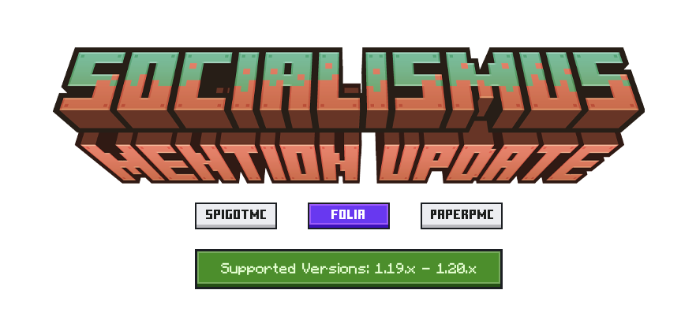
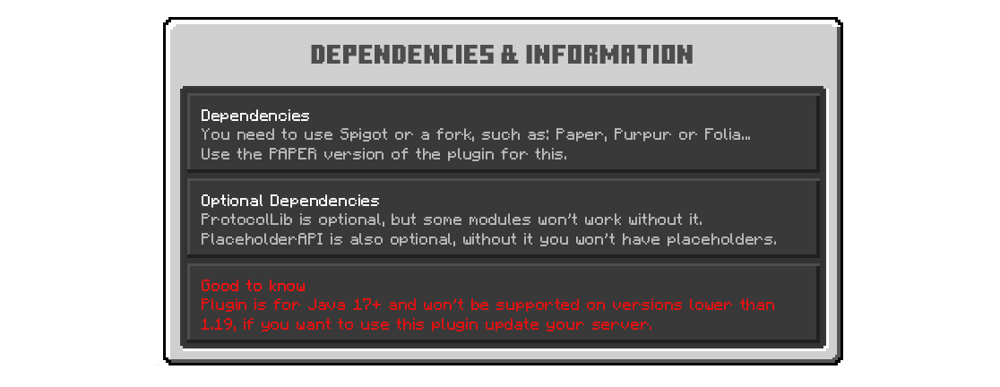
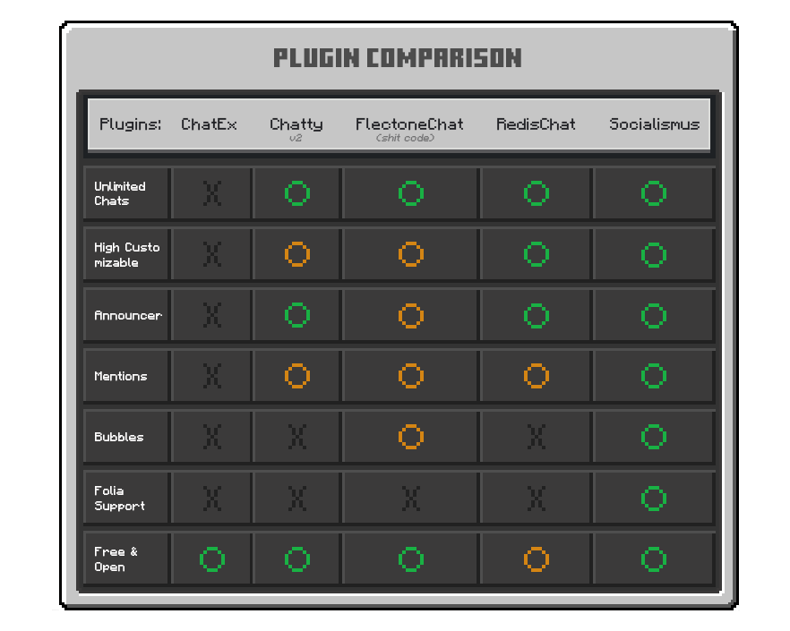

# Using the API

If you are in need of help with the API, you can ask me directly or the community on our [Discord server](https://discord.arcadeya.com/). You
can also read
the [Javadocs](https://javadoc.jitpack.io/com/github/whereareiam/Socialismus/api/latest/javadoc/index.html).

To use the plugins API, you need to add JitPack to your repository and add the dependency to your project.

## Maven

```xml

<repositories>
    <repository>
        <id>jitpack.io</id>
        <url>https://jitpack.io/</url>
    </repository>
</repositories>
```

```xml

<dependencies>
    <dependency>
        <groupId>com.github.whereareiam.Socialismus</groupId>
        <artifactId>api</artifactId>
        <version>VERSION</version>
        <scope>provided</scope>
    </dependency>
</dependencies>
```

## Gradle

```groovy
repositories {
    maven { url 'https://jitpack.io' }
}
```

```groovy
dependencies {
    implementation 'com.github.whereareiam.Socialismus:api:VERSION'
}
```

**For versions, you can use the following: dev-SNAPSHOT or any version from the releases page (for example 1.2.0).**

## Getting the plugin instance

To get the plugin instance, you need to use the following code:

```java
SocialismusAPI api = SocialismusAPI.getInstance();
```

# Statistics


  
